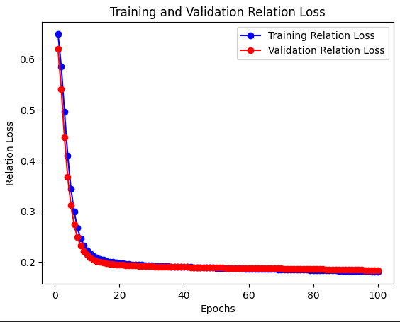

# Multi-Task Transformer for Slot Tagging and Relation Extraction

## Overview

This is a personal side project where I built a Transformer model in PyTorch to tackle two natural language processing tasks at once: IOB slot tagging and utterance relation extraction. I designed a unified Transformer architecture to handle both tasks efficiently, exploring how joint training compares to training separate models. The project dives into model design, hyperparameter tuning, and performance analysis, aiming to find the best setup for multi-task learning. I evaluated the results using F1 scores and documented the process to understand what works best.

## Features

- **Joint Task Processing**: A single Transformer model handles both IOB slot tagging and relation extraction.
- **Custom Architecture**: Built from scratch with PyTorch, including embeddings, encoder layers, and task-specific classifiers.
- **Hyperparameter Exploration**: Tested various settings like learning rate, batch size, and hidden dimensions to optimize performance.
- **Performance Metrics**: Measured success with F1 scores for both tasks.

## Data Description

The dataset I used includes 2,254 sets of utterances, paired with IOB slot tags and core relations. Here’s a quick example:

| Utterance                | IOB Slot Tags                  | Core Relations              |
|--------------------------|--------------------------------|-----------------------------|
| who plays luke on star wars new hope | O O B-char O B-movie I-movie I-movie I-movie | movie.starring.actor, movie.starring.character |

The data has a lot of "O" tags (over 75%), which made balancing the training a bit tricky.

## Technical Details

### Tools
- **Language**: Python
- **Framework**: PyTorch (core model and data processing)
- **Libraries**: Gensim (GloVe embeddings), Pandas, Scikit-learn (data prep and utils)

### Preprocessing
- Filled missing data with "none."
- Tokenized all columns, replaced underscores with dashes.
- Added padding and unknown tokens.
- Used a multi-label binarizer for core relations.
- Set up a DataLoader for mini-batching.

### Model Architecture
The `TransformerForIOBandRelation` class powers the project:
- **Embedding Layer**: Maps tokens to dense vectors using GloVe embeddings.
- **Transformer Encoder**: Stacks multiple layers with multi-head self-attention and feed-forward networks.
- **IOB Classifier**: Predicts slot tags for each token.
- **Relation Classifier**: Aggregates sequence output (via mean) to predict relations.

## Experiments

### Data Split
I split the data into 90% training and 10% validation. I tried an 80/20 split first, but the smaller dataset and tag imbalance (too many "O" tags) hurt performance. The 90/10 split improved results by 5-10%.

### Joint vs. Separate Training
I compared training both tasks together (joint) versus separately:
- **Joint Training**: F1 Tag: 0.3, F1 Relations: 0.52
- **Separate Tagging**: F1 Tag: 0.34, F1 Relations: 0
- **Separate Relations**: F1 Tag: 0, F1 Relations: 0.62

Separate training edged out slightly in performance but took twice as long. For efficiency, joint training felt like the better trade-off.

### Hyperparameter Tuning
I tested 15 combinations, tweaking:
- **Batch Size**: 4, 8, 16 (minimal impact, possibly due to overfitting).
- **Optimizer**: SGD, RMSprop, Adagrad, Adam (Adam worked best; others underfit).
- **Learning Rate**: 2e-6, 2e-4, 2e-2 (model was sensitive; smaller adjustments helped).
- **Hidden Dimension**: 64, 128, 1024 (64 and 1024 outperformed 128, oddly).

## Results

The best model hit an F1 score of 0.48 for tagging and 0.78 for relations with:
- Learning Rate: 6e-4
- Batch Size: 8
- Hidden Dimension: 64
- Optimizer: Adam

Relation training converged fast, while tagging needed more epochs. The model’s sensitivity to learning rate and odd hidden dimension results might stem from its simple structure and noisy data. Fine-tuning the output threshold could improve things further—maybe with an SVM next time.

## Visual Showcases

Here are some plots showing the training process:

  
*Caption: Loss curves for training and validation across both tasks.*

  
*Caption: Loss for IOB slot tagging over epochs.*

  
*Caption: Accuracy trends for IOB slot tagging.*

  
*Caption: Loss for relation extraction over epochs.*

  
*Caption: Accuracy trends for relation extraction.*

## What I Learned
- Got hands-on with Transformers and multi-task learning in PyTorch.
- Explored the trade-offs of joint vs. separate training.
- Learned how sensitive simple models can be to hyperparameters and data quirks.

## Next Steps
- Fine-tune the output threshold with an SVM or similar.
- Test a deeper model to reduce overfitting.
- Balance the dataset to handle the "O" tag dominance.
